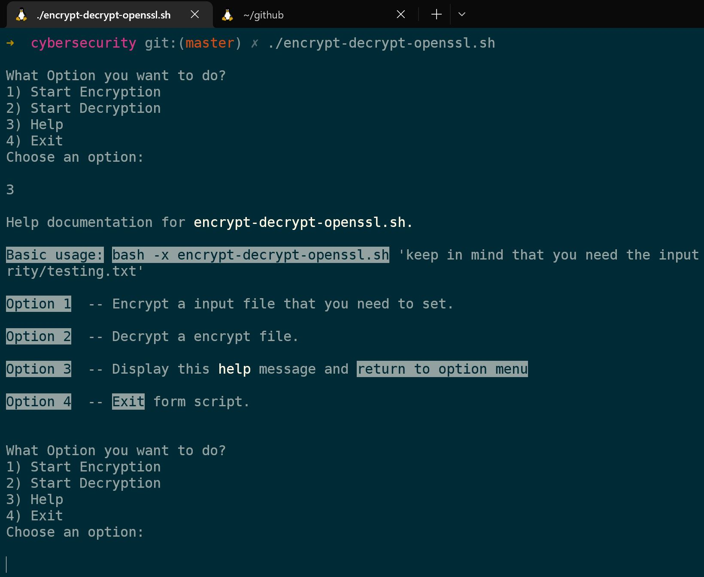

### Run

```sh
git clone https://github.com/danielitogomez/bash.git
cd $PWD/bash/cybersecurity
./encrypt-decrypt-openssl.sh
```

## Notes
1. Into testing.txt file please set the string that you want to encrypt, the script is going to ask you for encryption password and vicerversa.
2. You also have a help menu to select the options.

## Help

