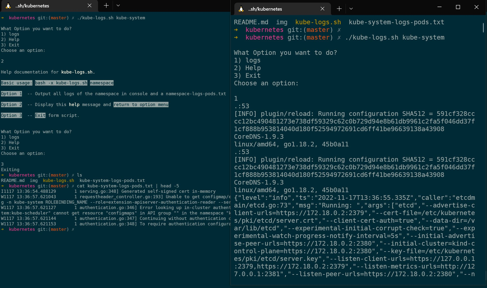

### Run

```sh
git clone https://github.com/danielitogomez/bash.git
cd $PWD/bash/kubernetes
./kube-logs.sh namespace-name
```

## Notes
1. The logs are going to output in console but you can see it with cat namespace-name-logs-pods.txt file created.

## Help

