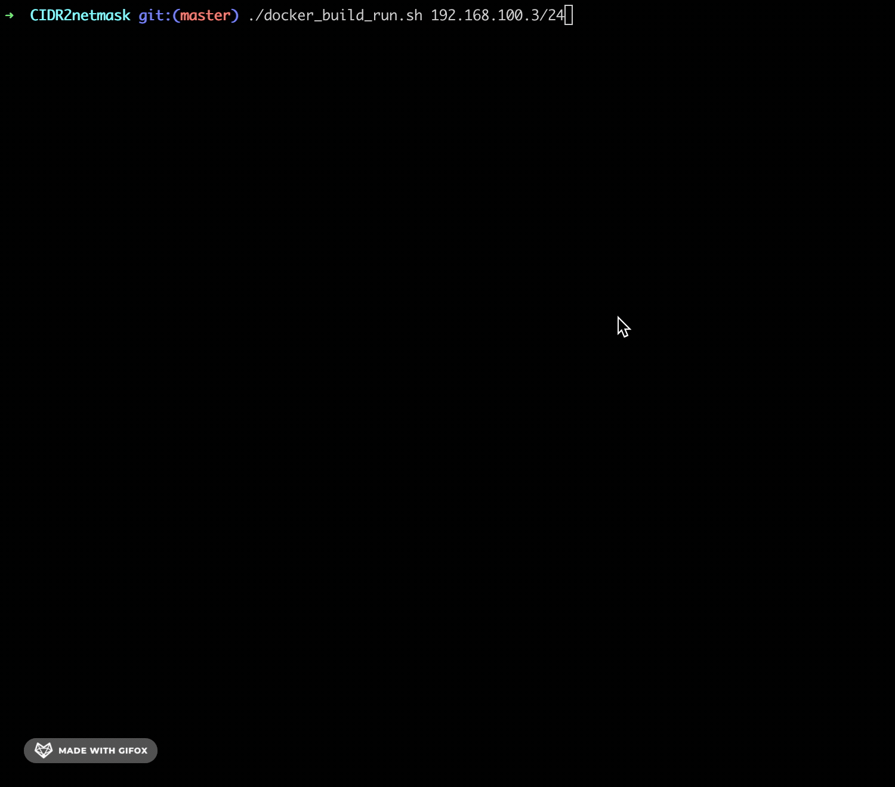

## NetAdmin Tool Convert CIDR to Netmask
Using bash script we can apply logic for convert CIDR to Netmask and using Docker we can run this script into a container.

## Requirements
To have docker and git installed on your computer.

## How to use?
* Using bash script
```
$ git clone https://github.com/danielitogomez/bash.git
$ cd $PWD/bash/netadmin-tools/CIDR2netmask
$ ./CIDR-to-netmask.sh {IP/CIDR}
```

* Using Docker
```
$ git clone https://github.com/danielitogomez/bash.git
$ cd $PWD/bash/netadmin-tools/CIDR2netmask
$ ./docker_buid_run.sh {IP/CIDR}
```

* Using Docker && Make
```
$ git clone https://github.com/danielitogomez/bash.git
$ cd $PWD/bash/netadmin-tools/CIDR2netmask
$ make all arg1=IP/CIDR
```

## Example
```
$ git clone https://github.com/danielitogomez/bash.git
$ cd $PWD/bash/netadmin-tools/CIDR2netmask
$ ./docker_buid_run.sh 192.168.100.3/24
```


