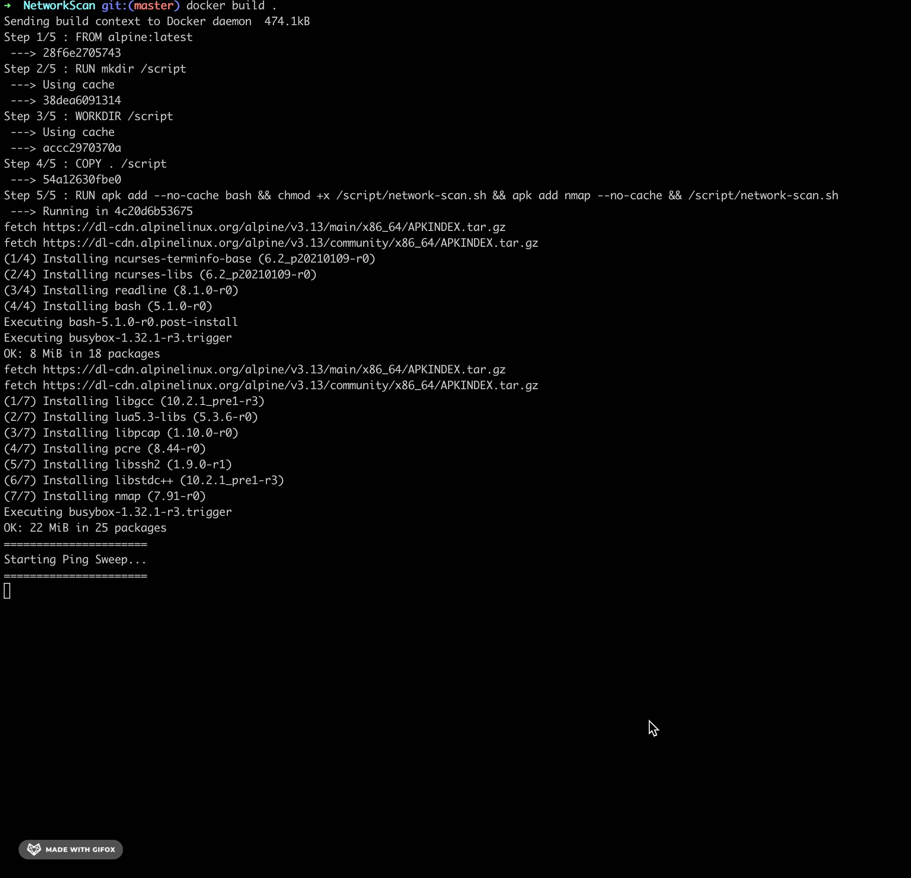
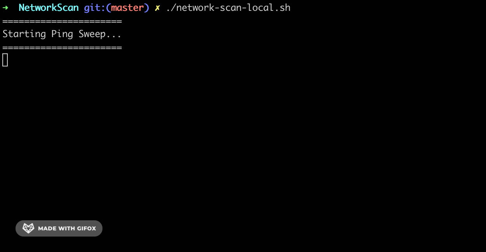

## Network Scan NetAdmin tool
A script for ping sweep over several hosts and scan over host that reachable.

## Requirements
To have docker and git installed on your computer if you are going to use Docker.<br/>
To have git and nmap installed on your computer if you want run local script.

## With Docker
```
git clone https://github.com/danielitogomez/bash.git
cd $PWD/bash/netadmin-tools/NetworkScan
export name=network-scan
docker build -t $name .
docker run -it $name
```



## Locally
```
git clone https://github.com/danielitogomez/bash.git
cd $PWD/bash/netadmin-tools/NetworkScan
./network-scan-local.sh
```


