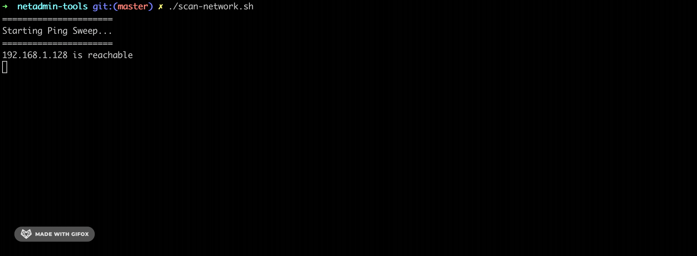

## NetAdmin Tool Scan Network
A script for ping sweep over several hosts and scan over host that reachable.

## Requirements
To have docker and git installed on your computer. (using Docker)
To have git and nmap installed on your computer. (run local script)

## Run example with docker
```
$ git clone https://github.com/danielitogomez/bash.git
$ cd $PWD/bash/netadmin-tools/ScanNetwork
$ docker build .
```


## Run example locally
```
$ git clone https://github.com/danielitogomez/bash.git
$ cd $PWD/bash/netadmin-tools/ScanNetwork
$ ./scan-network-local.sh
```


